本博客使用hugo + github + vercel方案部署，记录时间2026/2/25，[参考教程](https://hongtaoh.com/cn/2024/03/22/personal-website-tutorial/)来自[郝鸿涛](https://hongtaoh.com/cn/blog/)博主。

## 0. 前置知识

- `Github`使用：博客中的所有内容都存储在 GitHub 仓库中，使用 git 进行版本控制和管理。每次修改内容后，提交到 GitHub 仓库。
- `Hugo`：是一个基于 Go 语言的静态站点生成器，生成本质是将 Markdown 文件通过模板渲染成静态 HTML 页面。Hugo 会读取 content 目录下的 Markdown 文件，结合 themes 中定义的布局模板，最终输出纯静态的 HTML/CSS/JS 文件到 public 目录。
- `Vercel`：是一个云平台，提供静态网站托管和自动部署服务。每次将修改推送到 GitHub 仓库后，Vercel 会自动检测到变化，重新构建 Hugo 站点。

## 1. Hugo安装

本方案中[Hugo](https://github.com/gohugoio/hugo)可以选择在本地运行构建，也可以选择在vercel上构建。由于调试需求，本方案在本地**windows系统**中安装Hugo并且调试博客，后续部署到vercel上。

- 第一步，下载。根据系统选择[安装方式](https://gohugo.io/installation/)。根据指引到github的[发布界面](https://github.com/gohugoio/hugo/releases/latest)下载预编译的二进制包，下滑找到对应的系统/架构。
  
  例如我的电脑是amd指令集，并且希望本地构建，所以我下载拓展包[hugo_extended_0.155.3_windows-amd64.zip](https://github.com/gohugoio/hugo/releases/download/v0.155.3/hugo_extended_0.155.3_windows-amd64.zip)版本。
  如果不确定电脑指令集可以在设置->系统->系统信息中查看。
  

- 第二步，配置环境变量。下载后保存到指定目录并且解压文件夹，**记录解压的路径**。继续设置环境变量，可以直接在windows的搜索中搜索关键词打开环境变量编辑。 
  

   - 点击环境变量
   
   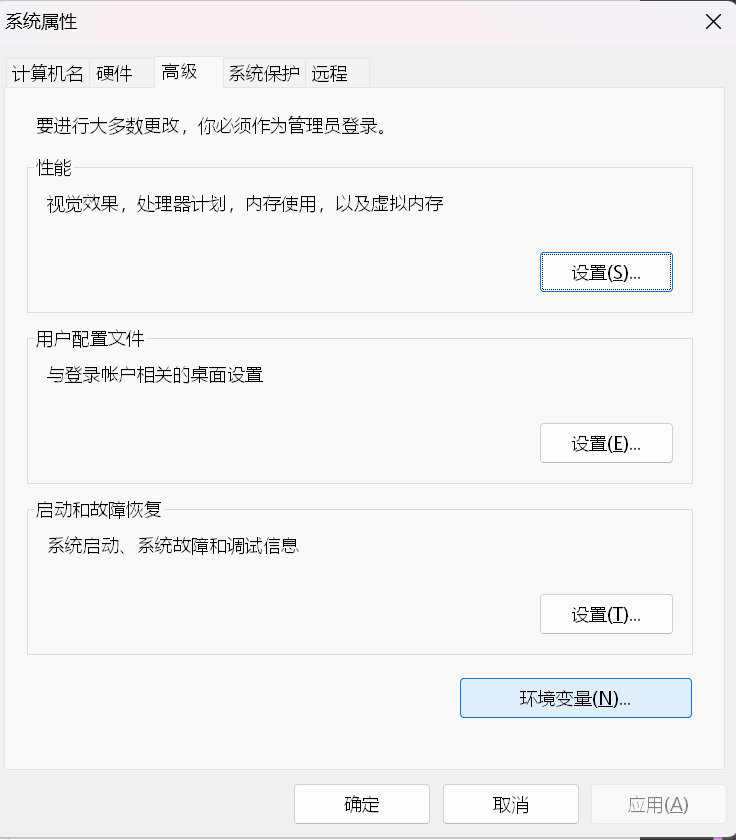

   - 选中并且编辑**用户环境变量Path** -> **新建**一个路径 -> 粘贴刚刚解压的预编译版本的路径，最后一路点击确定，环境变量设置好了。
  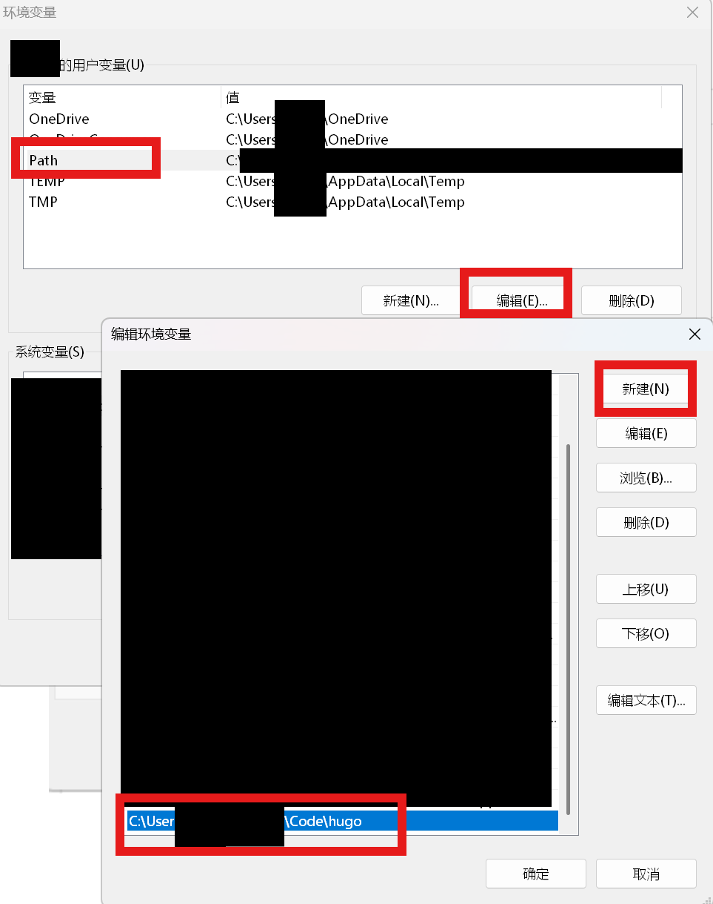

  - 打开一个终端`powershell`终端，测试一下

   ```powershell
   PS C:\Users> hugo version # 正常输出版本号即配置成功
   hugo v0.155.3-8a858213b73907e823e2be2b5640a0ce4c04d295+extended windows/amd64 BuildDate=2026-02-08T16:40:42Z VendorInfo=gohugoio
   ```

- 第三步，安装编译器[Dart Sass](https://gohugo.io/functions/css/sass/#dart-sass)。windows下需要使用包管理器[Scoop](https://scoop.sh/#/apps?q=sass)或者[Chocolatey](https://community.chocolatey.org/packages/sass)，下面以Scoop为例，[安装Scoop参考教程](https://zhuanlan.zhihu.com/p/1931641798855458999)

   ```powershell
   Set-ExecutionPolicy RemoteSigned -Scope CurrentUser  -Force # 修改默认策略为同意
   iwr -useb scoop.201704.xyz | iex # 安装scoop到用户目录 这里使用的镜像站
   scoop help # 有正常输出说明成功安装

   scoop install main/sass # 安装sass
   sass --version # 输出版本号说明成功安装 1.83.4
   ```

## 2. 搭建站点

- 第一步， 本地继续使用`powershell`用`Hugo`初始化一个目录用来存放所有文件，并且**移动到改目录下**

   ```powershell
   blog> hugo new site MyBlog # 在当前目录下创建一个新的 Hugo 站点，目录名为 MyBlog
   Congratulations! Your new Hugo project was created in blog\MyBlog.

   Just a few more steps...

   1. Change the current directory to blog\MyBlog.
   2. Create or install a theme:
      - Create a new theme with the command "hugo new theme <THEMENAME>"
      - Or, install a theme from https://themes.gohugo.io/
   3. Edit hugo.toml, setting the "theme" property to the theme name.
   4. Create new content with the command "hugo new content <SECTIONNAME>\<FILENAME>.<FORMAT>".
   5. Start the embedded web server with the command "hugo server --buildDrafts".

   See documentation at https://gohugo.io/.

   blog> cd MyBlog   # 移动到MyBlog目录
   blog\MyBlog>
   ```

- 第二步，在github中新建一个仓库，并且把本地MyBlog目录链接到远程仓库

   ```powershell
   blog\MyBlog> git init # 初始化仓库
   Initialized empty Git repository in /blog/MyBlog/.git/
   blog\MyBlog> git remote add origin https://github.com/huluhuluu/MyBlog.git  # 链接远程仓库
   ```

- 第三步， 查找并且下载想要的[站点主题](https://themes.gohugo.io/tags/blog/)，点击Download会跳转到github仓库链接，例如[Anatole](https://github.com/lxndrblz/anatole)。把主题作为submodule拉取下来

   ```powershell
   blog\MyBlog> git submodule add https://github.com/lxndrblz/anatole.git themes/anatole
   Cloning into '/blog/MyBlog/themes/anatole'...
   remote: Enumerating objects: 5345, done.
   Receiving objects: 100% (5345/5345), 7.96 MiB | 4.72 MiB/s, done.5 (from 1)Receiving objects: 100% (5345/5345), 1.49 MiB | 1.21 MiB/s

   Resolving deltas: 100% (3145/3145), done.
   blog\MyBlog> Add-Content -Path "hugo.toml" -Value "`ntheme = `"anatole`""
   ```

- 第四步，测试一下主题

   ```powershell
   cd themes/anatole/exampleSite # 移动到示例目录
   hugo server --themesDir ../.. # 启动hugo
      # 出现下面输出
   blog\MyBlog\themes\anatole\exampleSite> hugo server --themesDir ../..

   Watching for changes in ...
   Start building sites …
   hugo v0.155.3-8a858213b73907e823e2be2b5640a0ce4c04d295+extended windows/amd64 BuildDate=2026-02-08T16:40:42Z VendorInfo=gohugoio

   WARN  The "x" shortcode was unable to retrieve the remote data: template: _shortcodes/x.html:20:25: executing "render-x" at <resources.GetRemote>: error calling GetRemote: Get "https://publish.x.com/oembed?dnt=false&url=https%3A%2F%2Fx.com%2FSanDiegoZoo%2Fstatus%2F1453110110599868418": net/http: TLS handshake timeout. See "blog\MyBlog\themes\anatole\exampleSite\content\english\post\rich-content.md:26:1"
   You can suppress this warning by adding the following to your site configuration:
   ignoreLogs = ['shortcode-x-getremote']
   WARN  The "vimeo_simple" shortcode was unable to retrieve the remote data: template: _shortcodes/vimeo_simple.html:26:25: executing "render-vimeo" at <resources.GetRemote>: error calling GetRemote: Get "https://vimeo.com/api/oembed.json?dnt=0&url=https%3A%2F%2Fvimeo.com%2F48912912": dial tcp 31.13.94.41:443: connectex: A connection attempt failed because the connected party did not properly respond after a period of time, or established connection failed because connected host did not properly respond.. See "blog\MyBlog\themes\anatole\exampleSite\content\english\post\rich-content.md:34:1"
   You can suppress this warning by adding the following to your site configuration:
   ignoreLogs = ['shortcode-vimeo-simple']

                     │ EN │ AR
   ──────────────────┼────┼────
   Pages            │ 68 │ 20
   Paginator pages  │  1 │  0
   Non-page files   │  0 │  0
   Static files     │ 13 │ 13
   Processed images │  0 │  0
   Aliases          │ 13 │  9
   Cleaned          │  0 │  0

   Built in 31850 ms
   Environment: "development"
   Serving pages from disk
   Running in Fast Render Mode. For full rebuilds on change: hugo server --disableFastRender
   Web Server is available at http://localhost:1313/ (bind address 127.0.0.1)
   Press Ctrl+C to stop
   ```
   在浏览器打开网页部署的地址http://localhost:1313/如下，说明能够正常使用

   

### 2.1 目录结构说明

Hugo 的目录结构如下：

```
MyBlog/
├── config/_default/       # 配置文件目录 (推荐分离配置)
│   ├── hugo.toml          # 主配置文件
│   ├── params.toml        # 主题参数配置
│   ├── languages.toml     # 语言配置
│   └── menus.*.toml       # 菜单配置
├── content/               # 内容目录
│   ├── post/              # 博客文章
│   └── about/             # 关于页面
├── archetypes/            # 文章模板
├── assets/                # 需要处理的资源 (CSS/JS)
├── static/                # 静态资源
├── themes/                # 主题目录
├── public/                # 构建输出 (需要加入gitignore)
└── resources/             # Hugo 缓存 (需要加入gitignore)
```

关键目录说明：
- **config/**: Hugo 支持将配置拆分成多个文件，便于管理
- **content/**: 存放所有 Markdown 文章，每个文章可以是一个单独的文件夹，方便管理图片
- **static/**: 存放图片、favicon 等静态资源，构建时会直接复制到 public 目录
- **themes/**: 主题文件，建议用 git submodule 管理

### 2.2 修改并且推送到远程仓库
- 修改博客内容，例如在`content/post/`目录下新建一个markdown文件`hello-world.md`，并且添加一些内容，这里我使用[iflow agent](../useful-tools/index.zh.md/#14-iflow)帮我配置主题以及个人信息和博客；
- 把本地内容推送到远程仓库:
   ```powershell
   blog\MyBlog> git add . # 添加修改到暂存区
   blog\MyBlog> git commit -m "init repo"	# 保存暂存区修改
   [master (root-commit) 94d3942] init repo
   46 files changed, 1088 insertions(+)

   blog\MyBlog> git push -u origin master # 推送至远程仓库
   Enumerating objects: 62, done.
   Counting objects: 100% (62/62), done.
   Delta compression using up to 16 threads
   Compressing objects: 100% (53/53), done.
   Writing objects: 100% (62/62), 735.91 KiB | 21.64 MiB/s, done.
   Total 62 (delta 1), reused 0 (delta 1), pack-reused 0
   remote: Resolving deltas: 100% (1/1), done.
   To https://github.com/huluhuluu/MyBlog.git
   * [new branch]      master -> master
   branch 'master' set up to track 'origin/master'.
   ```
   **注意：需要把构建的中间产物 public/ 和 resources/ 目录加入 .gitignore 文件中，避免推送到远程仓库**
   ```
   # .gitignore 文件
   public/
   resources/

   # agents 相关文件
   AGENTS.md
   ```

## 3. vercel部署
这里分静态部署和动态部署两种方式，静态部署是指在本地构建好的静态文件，动态部署是指每次修改内容后直接推送到github，vercel会自动检测到变化并且重新构建和部署。这里选择动态部署的方式:

- 打开[Vercel](https://vercel.com/),点击`Add New -> Project`新建项目，使用github快速登录

   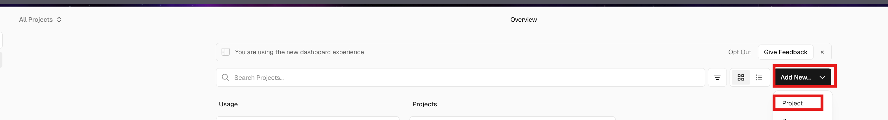

- 选择个人账号里需要部署的仓库, 点击Install继续：

   

- 选好后如下图，点击`Import`继续导入：
   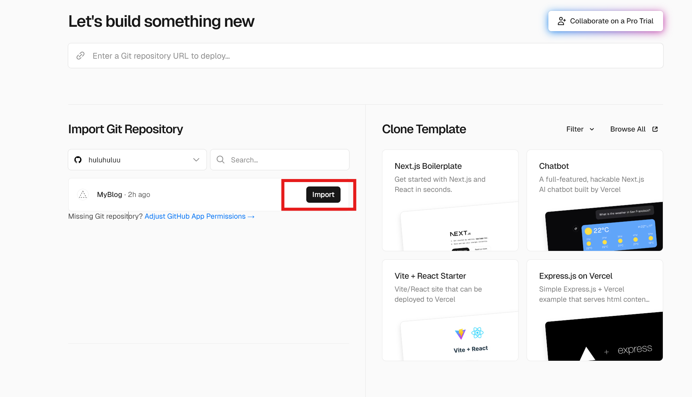
- 进入项目设置界面，选择`Application Preset`为`Hugo`，并且配置环境变量`HUGO_VERSION`为自己使用的版本号，点击`Deploy`继续：
   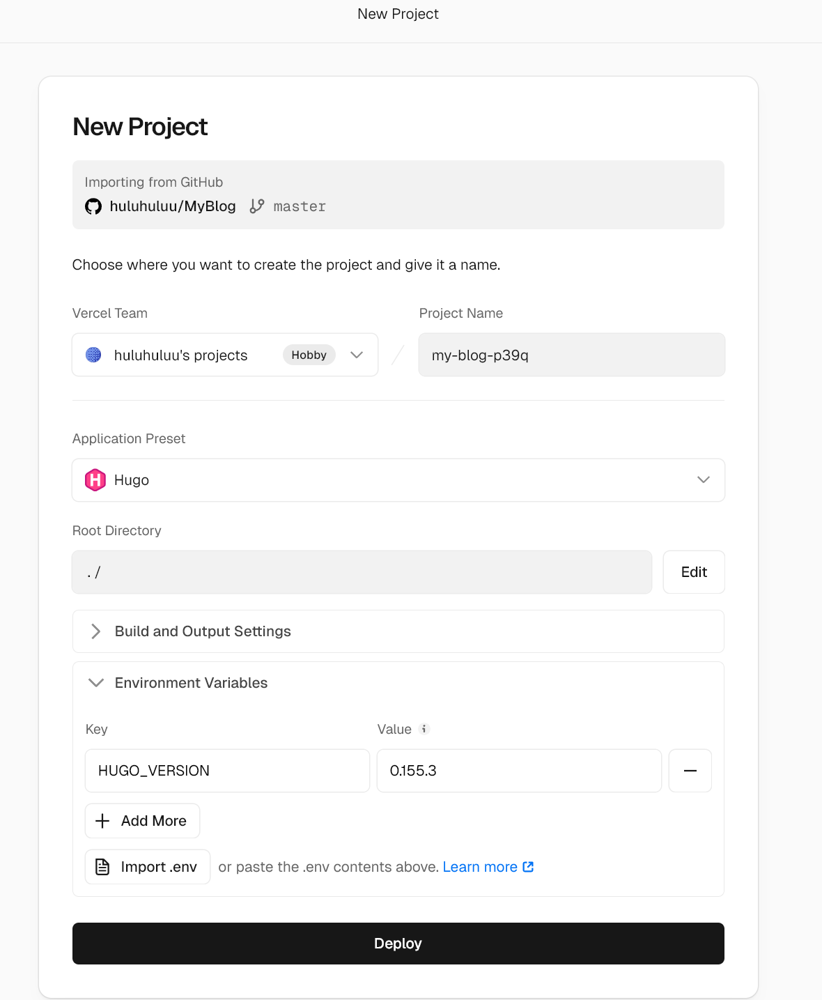
   `HUGO_VERSION`是安装时下载文件上的版本号，可以通过powershell命令查看：
   ```powershell
   PS C:\Users> hugo version
   hugo v0.155.3-8a858213b73907e823e2be2b5640a0ce4c04d295+extended windows/amd64 BuildDate=2026-02-08T16:40:42Z VendorInfo=gohugoio
   ```
- 部署完成后进入仪表盘`Continue to Dashboard`：

   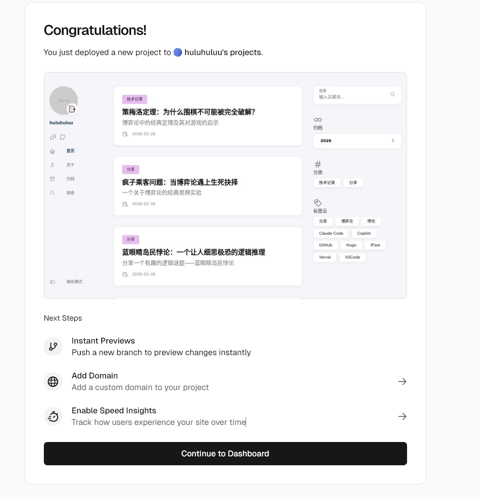

   可以看到vercel分配的域名，
   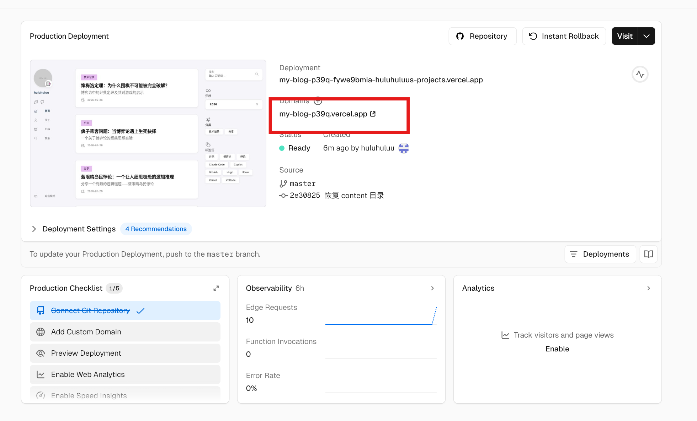

   访问即可看到部署好的博客
   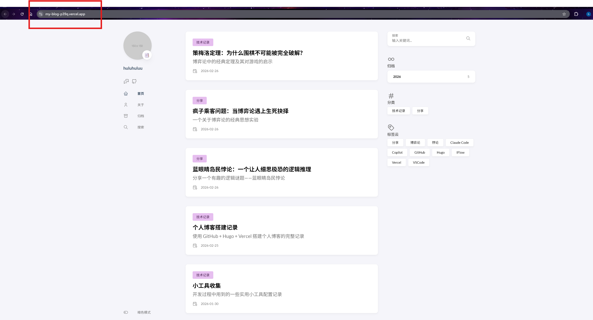
   
### 3.1 添加博客
后续添加博客需要在本地content/post/目录下新建markdown文件，添加内容后提交到github仓库，vercel会自动检测到变化并且重新构建和部署，访问博客即可看到更新后的内容。

## 3.2 评论系统Giscus
[Giscus](https://giscus.app/)是一个基于GitHub Discussions的评论系统，可以方便地集成到博客中([参考教程](https://www.lixueduan.com/posts/blog/02-add-giscus-comment/)，[官方教程](https://giscus.app/zh-CN))。

- 第一步，在GitHub仓库中点击设置
   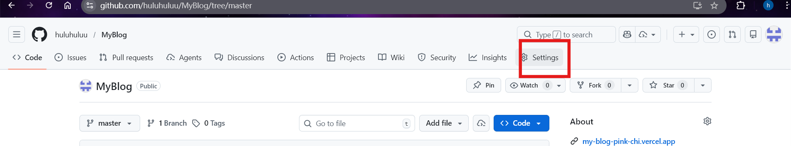
   下滑打开Discussion，用于存放评论数据。
   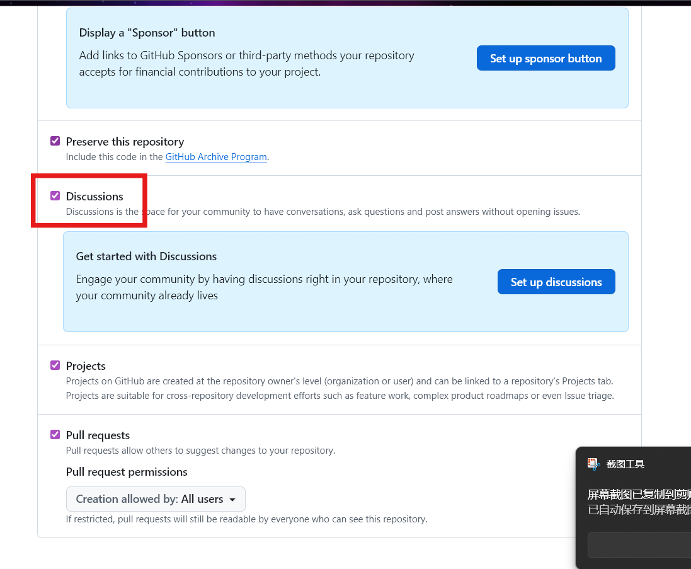
   注意仓库必须是public访问的，才能使用giscus评论系统，在设置界面继续下滑可以找到可见性设置，确保仓库是public的。
   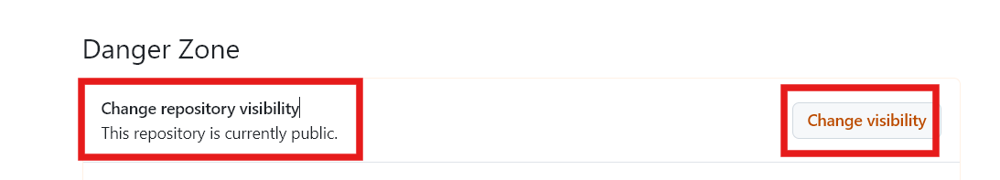
- 第二步，访问[giscus.app](https://giscus.app/)，第一次打开是install，选择前面创建的github仓库
  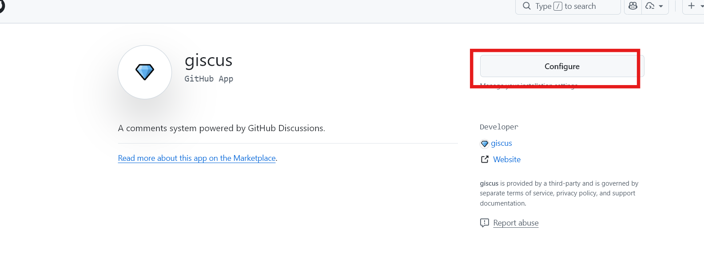
  随后在[giscus页面](https://giscus.app/zh-CN)，输入仓库链接，验证仓库是否可用giscus评论系统
  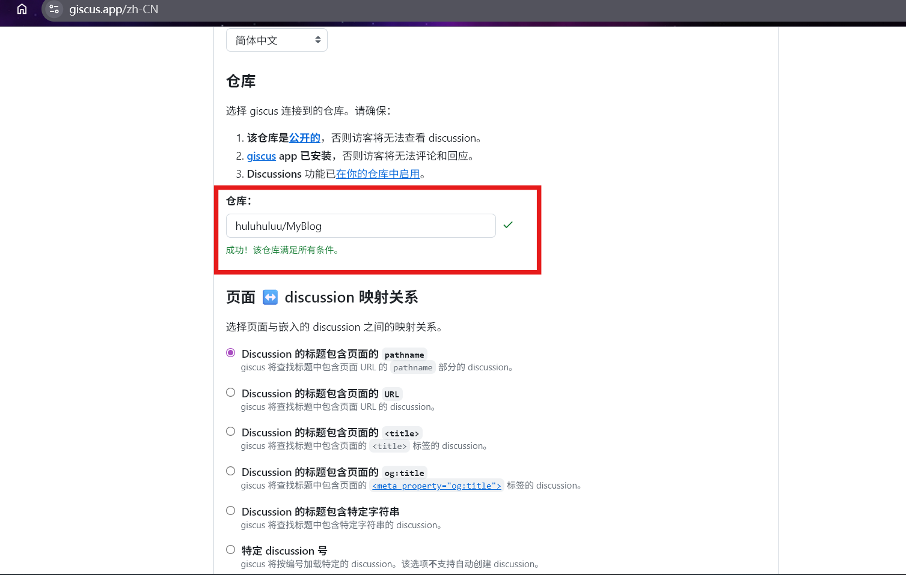
  在giscus页面继续下滑，根据提示配置你的仓库和Discussion分类，例如这里discussion分类选择Announcements，继续下滑可以看到生成的`<script>` 标签，复制下来。
  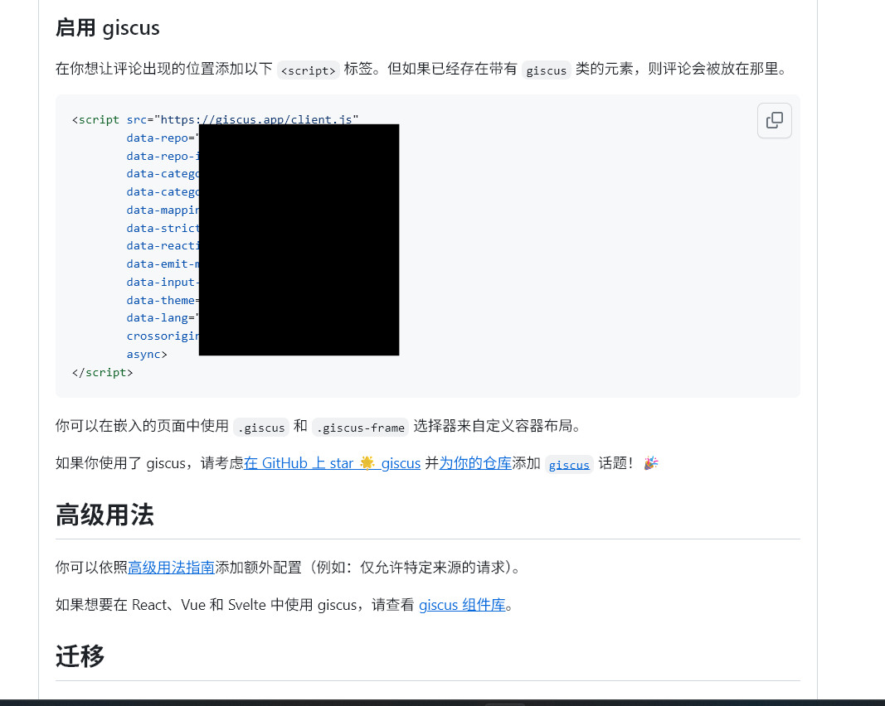

- 第三步，在Hugo博客的配置文件中添加Giscus的相关设置。例如这里添加在`params.toml`中：
   

## 3.3 子仓库自动更新
如果博客中使用了`git submodule`管理内容，那么每次更新子模块后需要在主仓库中提交子模块的更新，否则vercel部署时会拉取不到最新版本。例如这里我在`content/post/mnn-tutorial`子模块中更新了内容，提交并且推送到远程仓库后，还需要在主仓库中提交子模块的更新：

```powershell
blog\MyBlog> git add content/post/mnn-tutorial # 添加子模块更新到暂存区
blog\MyBlog> git commit -m "update mnn tutorial" # 保存暂存区修改
blog\MyBlog> git push origin master # 推送至远程仓库
```

`github` 提供了`GitHub Actions`功能，可以在每次子模块更新后自动提交主仓库的更新，避免忘记提交导致vercel部署失败。可以[参考](https://blog.futrime.com/zh-cn/p/github%E5%AE%9E%E7%8E%B0%E8%87%AA%E5%8A%A8%E6%9B%B4%E6%96%B0%E5%AD%90%E6%A8%A1%E5%9D%97/)。

- 先在`github`设置中打开开发者设置: `settings -> Developer settings`
   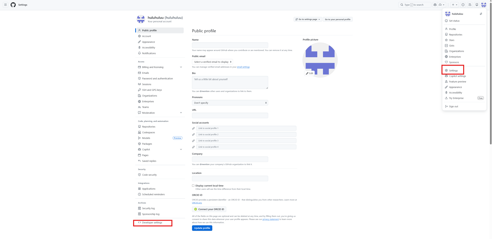
- 新建一个`Personal access tokens`，这里选择`classic`就够了, 需要更细粒度的权限可以选择`fine-grained`，点击`Generate new token`继续：
   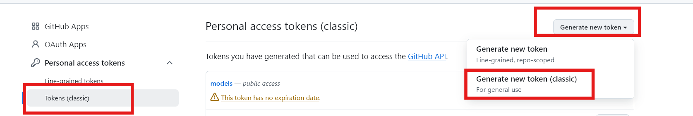
- 设置过期时间，选择`repo`权限，滑动到最下方生成Token后复制token值备用,**注意这个Token只可见一次，需要妥善保存**
   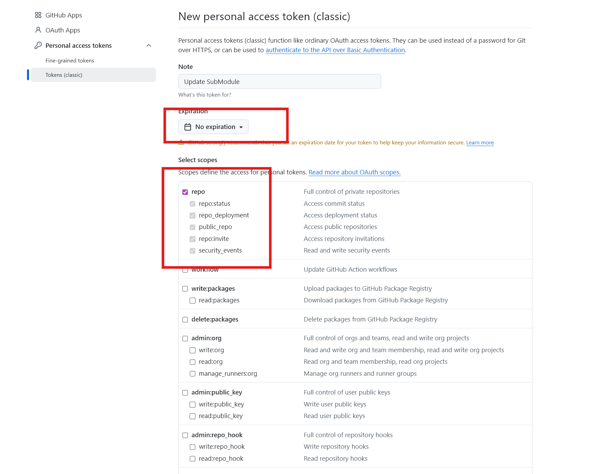
- 在**主仓库和子仓库**配置`Actions secrets`,`仓库设置 -> Secrets and variables -> Actions -> New repository secret`，
   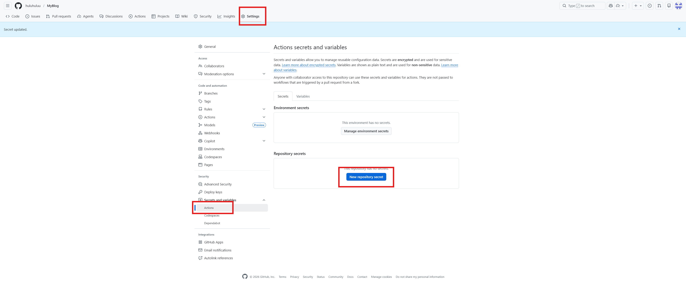
- 粘贴之前生成的Token值，点击添加保存：
   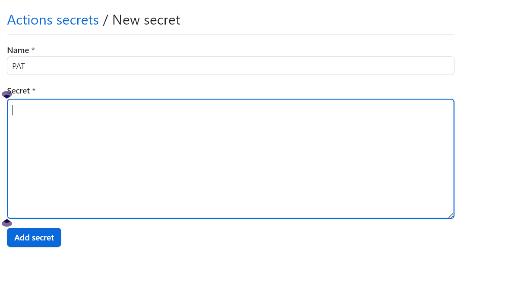
- `GitHub Actions` 通过编写工作流文件来定义自动化流程，需要在主仓库的 `.github/workflows` 目录下新建文件，例如命名为`update-submodule.yml`，并且添加内容(下面内容来自[iflow](../useful-tools/index.zh.md/#14-iflow)生成)：
   ```yaml
   name: Update Submodules

   on:
   # 接收来自子仓库的 repository_dispatch 事件
   repository_dispatch:
      types: [update-submodules] # 事件类型，需与子仓库发送的事件名一致
   workflow_dispatch:

   jobs:
   update:
      runs-on: ubuntu-latest # 运行环境
      steps:
         - uses: actions/checkout@v4
         with:
            submodules: true
            fetch-depth: 0
            token: ${{ secrets.PAT }}

          # 更新子模块到远程最新版本
         - name: Update submodules
         run: git submodule update --remote --merge

         # 提交更改并推送
         - name: Commit and push
         run: |
            git config user.name "github-actions[bot]"
            git config user.email "github-actions[bot]@users.noreply.github.com"
            git add .
            git diff --quiet && git diff --staged --quiet || git commit -m "chore: update submodules"
            git push https://x-access-token:${{ secrets.PAT }}@github.com/huluhuluu/MyBlog.git HEAD:master
   ```

- 同时需要在子仓库的 `.github/workflows` 目录下添加提醒的工作流文件，例如命名为`notify-parent.yml`，并且添加内容：
   ```yaml
   name: Notify Parent Repo

   # 触发条件：推送到 main 或 master 分支时
   on:
   push:
      branches: [main, master]
   workflow_dispatch:  # 手动触发按键
   jobs:
   notify:
      runs-on: ubuntu-latest
      steps:
         # 通知父仓库更新子模块
         - name: Trigger parent update
         uses: peter-evans/repository-dispatch@v3
         with:
            token: ${{ secrets.PAT }}
            repository: huluhuluu/MyBlog  # 父仓库地址
            event-type: update-submodules # 事件类型需与主仓库监听的事件名一致
   ```

- 测试，在子仓库提交一个更新并推送。在子仓库的`Actions`界面可以看到触发了`Notify Parent Repo`的工作流，并且旁边`Run workflow`按钮可以手动触发该通知工作流
   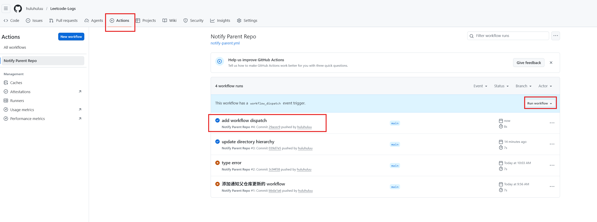
- 查看主仓库的`GitHub Actions`是否触发了更新子模块的工作流。
   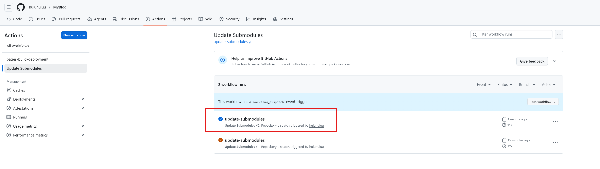