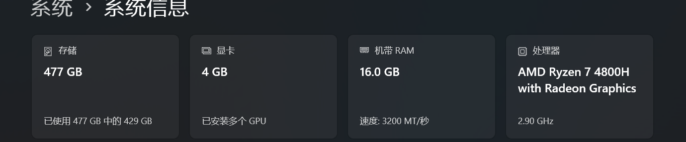
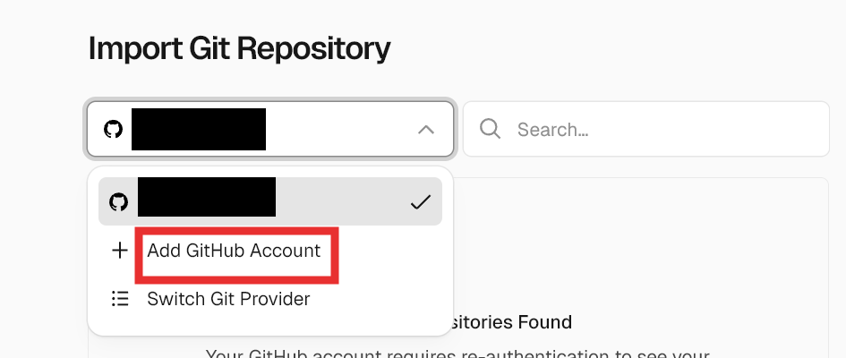

使用的是github + hugo + vercel方案，记录时间2026/2/25，[参考内容](https://hongtaoh.com/cn/2024/03/22/personal-website-tutorial/)来自[郝鸿涛](https://hongtaoh.com/cn/blog/)博主的教程。

## 0. 前置知识

- github使用
- hugo站点生成本质是将 Markdown 文件通过模板渲染成静态 HTML 页面。Hugo 会读取 content 目录下的 Markdown 文件，结合 themes 中定义的布局模板，最终输出纯静态的 HTML/CSS/JS 文件到 public 目录。这种静态站点的好处是部署简单、访问速度快、安全性高，而且可以免费托管在 GitHub Pages、Vercel、Netlify 等平台上。

## 1. hugo安装

[Hugo](https://github.com/gohugoio/hugo)是Go编写的静态站点生成器，针对速度进行了优化，可以在几秒钟内渲染出一个完整的网站，通常更短。

根据系统选择[安装方式](https://gohugo.io/installation/)，下面以windows系统为例，根据指引到github的[最新发布界面](https://github.com/gohugoio/hugo/releases/latest)下载预编译的二进制包，下滑找到对应的系统/架构，例如我的电脑是amd指令集(准确说是 **x86-64** 架构，由 AMD 和 Intel 主导，大部分都是AMD)，所以我下载[hugo_extended_0.155.3_windows-amd64.zip](https://github.com/gohugoio/hugo/releases/download/v0.155.3/hugo_extended_0.155.3_windows-amd64.zip)版本，如果不确定电脑指令集可以在设置->系统->系统信息中查看。



下载后选定目录并且解压文件夹，**记录解压的路径**。需要设置环境变量，直接在搜索中搜索关键词可以打开环境变量编辑。


继续点击环境变量


选中并且编辑用户环境变量Path -> 新建一个路径 -> 复制刚刚解压的预编译版本的路径，最后一路点击确定，环境变量设置好了。


打开一个终端powershell终端，测试一下

```powershell
PS C:\Users> hugo version # 正常输出版本号即配置成功
hugo v0.155.3-8a858213b73907e823e2be2b5640a0ce4c04d295+extended windows/amd64 BuildDate=2026-02-08T16:40:42Z VendorInfo=gohugoio
```

接着安装编译器[Dart Sass](https://gohugo.io/functions/css/sass/#dart-sass)，windows下需要使用包管理器[Scoop](https://scoop.sh/#/apps?q=sass)或者[Chocolatey](https://community.chocolatey.org/packages/sass)，下面以Scoop为例，[参考](https://zhuanlan.zhihu.com/p/1931641798855458999)

```powershell
Set-ExecutionPolicy RemoteSigned -Scope CurrentUser  -Force # 修改默认策略为同意
iwr -useb scoop.201704.xyz | iex # 安装scoop到用户目录 使用的镜像站
scoop help # 有正常输出说明成功安装

scoop install main/sass # 安装sass
sass --version # 输出版本号说明成功安装 1.83.4
```


## 2. 搭建站点

本地用Hugo初始化一个目录用来存放所有文件，并且**移动到改目录下**

```powershell
blog> hugo new site MyBlog
Congratulations! Your new Hugo project was created in blog\MyBlog.

Just a few more steps...

1. Change the current directory to blog\MyBlog.
2. Create or install a theme:
   - Create a new theme with the command "hugo new theme <THEMENAME>"
   - Or, install a theme from https://themes.gohugo.io/
3. Edit hugo.toml, setting the "theme" property to the theme name.
4. Create new content with the command "hugo new content <SECTIONNAME>\<FILENAME>.<FORMAT>".
5. Start the embedded web server with the command "hugo server --buildDrafts".

See documentation at https://gohugo.io/.

blog> cd MyBlog
blog\MyBlog>
```

在github中新建一个仓库，并且本地MyBlog目录链接到远程

```powershell
blog\MyBlog> git init # 初始化仓库
Initialized empty Git repository in /blog/MyBlog/.git/
blog\MyBlog> git remote add origin https://github.com/huluhuluu/MyBlog.git  # 链接远程仓库
```

查找并且下载想要的[站点主题](https://themes.gohugo.io/tags/blog/)，点击Download会跳转到github仓库链接，例如[Anatole](https://github.com/lxndrblz/anatole)，把主题作为submodule拉取下来

```powershell
blog\MyBlog> git submodule add https://github.com/lxndrblz/anatole.git themes/anatole
Cloning into '/blog/MyBlog/themes/anatole'...
remote: Enumerating objects: 5345, done.
Receiving objects: 100% (5345/5345), 7.96 MiB | 4.72 MiB/s, done.5 (from 1)Receiving objects: 100% (5345/5345), 1.49 MiB | 1.21 MiB/s

Resolving deltas: 100% (3145/3145), done.
blog\MyBlog> Add-Content -Path "hugo.toml" -Value "`ntheme = `"anatole`""
```

将 `exampleSite` 文件夹中的 `content` 和`hugo.yaml` 复制到主文件夹中，并删掉原来的 `hugo.toml` 

接下来把本地内容全部推送到远程仓库，

```powershell
blog\MyBlog> git add . # 添加修改到暂存区
blog\MyBlog> git commit -m "init repo"	# 保存暂存区修改
[master (root-commit) 94d3942] init repo
 46 files changed, 1088 insertions(+)

blog\MyBlog> git push -u origin master # 推送至远程仓库
Enumerating objects: 62, done.
Counting objects: 100% (62/62), done.
Delta compression using up to 16 threads
Compressing objects: 100% (53/53), done.
Writing objects: 100% (62/62), 735.91 KiB | 21.64 MiB/s, done.
Total 62 (delta 1), reused 0 (delta 1), pack-reused 0
remote: Resolving deltas: 100% (1/1), done.
To https://github.com/huluhuluu/MyBlog.git
 * [new branch]      master -> master
branch 'master' set up to track 'origin/master'.
```

测试一下主题

```powershell
cd themes/anatole/exampleSite # 移动到示例目录
hugo server --themesDir ../.. # 启动hugo

# 出现下面输出
blog\MyBlog\themes\anatole\exampleSite> hugo server --themesDir ../..

Watching for changes in ...
Start building sites …
hugo v0.155.3-8a858213b73907e823e2be2b5640a0ce4c04d295+extended windows/amd64 BuildDate=2026-02-08T16:40:42Z VendorInfo=gohugoio

WARN  The "x" shortcode was unable to retrieve the remote data: template: _shortcodes/x.html:20:25: executing "render-x" at <resources.GetRemote>: error calling GetRemote: Get "https://publish.x.com/oembed?dnt=false&url=https%3A%2F%2Fx.com%2FSanDiegoZoo%2Fstatus%2F1453110110599868418": net/http: TLS handshake timeout. See "blog\MyBlog\themes\anatole\exampleSite\content\english\post\rich-content.md:26:1"
You can suppress this warning by adding the following to your site configuration:
ignoreLogs = ['shortcode-x-getremote']
WARN  The "vimeo_simple" shortcode was unable to retrieve the remote data: template: _shortcodes/vimeo_simple.html:26:25: executing "render-vimeo" at <resources.GetRemote>: error calling GetRemote: Get "https://vimeo.com/api/oembed.json?dnt=0&url=https%3A%2F%2Fvimeo.com%2F48912912": dial tcp 31.13.94.41:443: connectex: A connection attempt failed because the connected party did not properly respond after a period of time, or established connection failed because connected host did not properly respond.. See "blog\MyBlog\themes\anatole\exampleSite\content\english\post\rich-content.md:34:1"
You can suppress this warning by adding the following to your site configuration:
ignoreLogs = ['shortcode-vimeo-simple']

                  │ EN │ AR
──────────────────┼────┼────
 Pages            │ 68 │ 20
 Paginator pages  │  1 │  0
 Non-page files   │  0 │  0
 Static files     │ 13 │ 13
 Processed images │  0 │  0
 Aliases          │ 13 │  9
 Cleaned          │  0 │  0

Built in 31850 ms
Environment: "development"
Serving pages from disk
Running in Fast Render Mode. For full rebuilds on change: hugo server --disableFastRender
Web Server is available at http://localhost:1313/ (bind address 127.0.0.1)
Press Ctrl+C to stop
```

在浏览器打开网页部署的地址http://localhost:1313/如下，说明能够正常使用


### 目录结构说明

```
MyBlog/
├── config/_default/       # 配置文件目录 (推荐分离配置)
│   ├── hugo.toml          # 主配置文件
│   ├── params.toml        # 主题参数配置
│   ├── languages.toml     # 语言配置
│   └── menus.*.toml       # 菜单配置
├── content/               # 内容目录
│   ├── post/              # 博客文章
│   └── about/             # 关于页面
├── archetypes/            # 文章模板
├── assets/                # 需要处理的资源 (CSS/JS)
├── static/                # 静态资源 (直接复制)
├── themes/                # 主题目录
├── public/                # 构建输出 (gitignore)
└── resources/             # Hugo 缓存 (gitignore)
```

关键目录说明：
- **config/**: Hugo 支持将配置拆分成多个文件，便于管理
- **content/**: 存放所有 Markdown 文章，每个文章可以是一个单独的文件夹，方便管理图片
- **static/**: 存放图片、favicon 等静态资源，构建时会直接复制到 public 目录
- **themes/**: 主题文件，建议用 git submodule 管理

## 3. vercel部署

打开[vercel](https://vercel.com/),点击**Start Deploying**，使用github快速登录


选择个人账号的仓库，并且install



按照提示完成部署即可。Vercel 会自动检测到 Hugo 项目并配置好构建命令。每次 push 到 GitHub，Vercel 会自动重新构建和部署。
